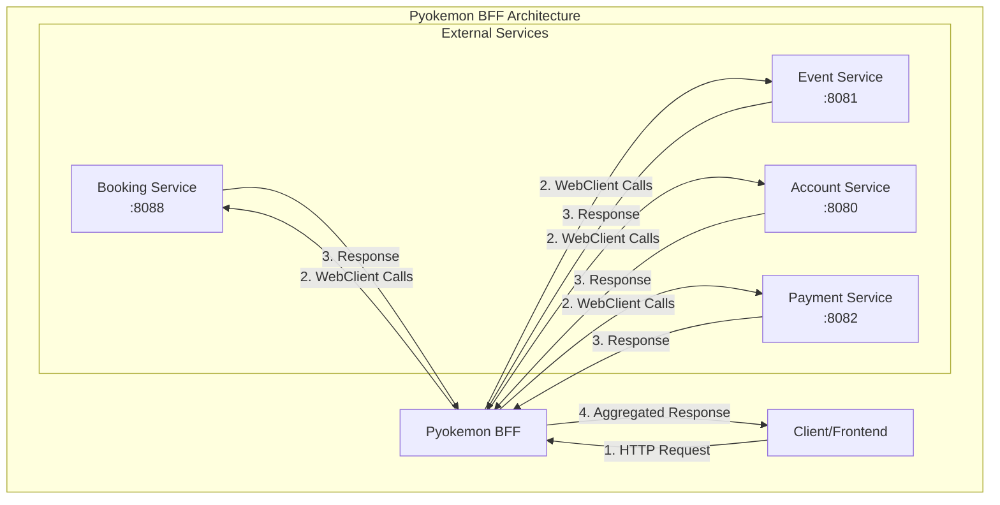
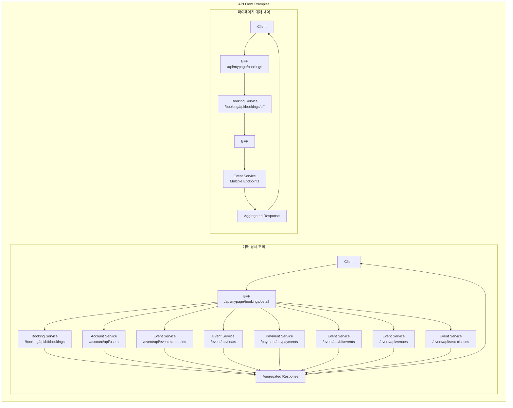

# Pyokemon BFF (Backend For Frontend)

## 프로젝트 개요

Pyokemon BFF는 티켓 예매 시스템의 프론트엔드와 백엔드 마이크로서비스 사이에서 중개 역할을 하는 BFF(Backend For Frontend) 서비스입니다. 이 서비스는 클라이언트 요청을 받아 필요한 데이터를 여러 마이크로서비스에서 조합하여 제공합니다.

## 주요 기능

1. **테넌트 예매 현황**: 테넌트별 예매 현황 조회
2. **사용자 마이페이지 내 예약**: 사용자별 예매 내역 조회
3. **사용자 예매 상세**: 특정 예매 건에 대한 상세 정보 조회

## 기술 스택

- Java 21
- Spring Boot 3.5.x
- Spring WebFlux (Reactive Stack)
- WebClient
- Gradle 8.x

## 아키텍처

BFF 패턴을 적용하여 다음과 같은 마이크로서비스와 통신합니다:

- `event-service` (8081): 공연 정보, 좌석 정보, 공연장 정보 제공
- `booking-service` (8088): 예매 정보 관리
- `account-service` (8080): 사용자 정보 관리
- `payment-service` (8082): 결제 정보 관리



## 프로젝트 구조

```
pyokemon-bff/
├── src/
│   ├── main/
│   │   ├── java/
│   │   │   └── com/
│   │   │       └── pyokemon/
│   │   │           └── bff/
│   │   │               ├── config/              # 설정 클래스
│   │   │               │   └── WebClientConfig.java
│   │   │               ├── controller/          # API 컨트롤러
│   │   │               │   ├── BookingController.java
│   │   │               │   ├── BookingDetailController.java
│   │   │               │   └── MyPageBookingController.java
│   │   │               ├── dto/                 # 데이터 전송 객체
│   │   │               │   ├── BookingStatus.java
│   │   │               │   ├── PaymentStatus.java
│   │   │               │   ├── external/        # 외부 서비스 DTO
│   │   │               │   │   ├── AccountDto.java
│   │   │               │   │   ├── BookingDto.java
│   │   │               │   │   ├── EventDto.java
│   │   │               │   │   ├── EventScheduleDto.java
│   │   │               │   │   ├── PaymentDto.java
│   │   │               │   │   ├── SeatClassDto.java
│   │   │               │   │   ├── SeatDto.java
│   │   │               │   │   ├── SeatPriceDto.java
│   │   │               │   │   └── VenueDto.java
│   │   │               │   └── response/        # 응답 DTO
│   │   │               │       ├── BookingDetailResponse.java
│   │   │               │       ├── BookingResponse.java
│   │   │               │       └── MyPageBookingResponse.java
│   │   │               ├── exception/           # 예외 처리
│   │   │               │   └── GlobalExceptionHandler.java
│   │   │               ├── filter/              # 필터
│   │   │               │   └── LoggingFilter.java
│   │   │               ├── service/             # 비즈니스 로직
│   │   │               │   ├── BookingDetailService.java
│   │   │               │   ├── BookingService.java
│   │   │               │   └── MyPageBookingService.java
│   │   │               └── PyokemonBffApplication.java
│   │   └── resources/
│   │       ├── application.yml
│   │       ├── dev-config.yml
│   │       └── log4j2.yml
│   └── test/
│       └── java/
│           └── com/
│               └── pyokemon/
│                   └── bff/
│                       └── PyokemonBffApplicationTests.java
├── build.gradle
├── settings.gradle
└── README.md
```

## API 엔드포인트

### 1. 테넌트 예매 현황

- **GET** `/bff/api/v1/bookings`
- **Query Parameters**:
  - `eventScheduleId`: 공연 일정 ID
- **응답 예시**:

```json
{
  "bookingId": 1001,
  "userName": "가나다",
  "eventTitle": "오아시스 내한",
  "eventDate": "2025-08-06",
  "venueName": "서울 올림픽 체조경기장",
  "seat": { "className": "VIP", "floor": 1, "row": "D", "col": "9" },
  "thumbnailUrl": "https://example.com/thumbnail/oasis.jpg",
  "totalPrice": 151000,
  "status": "결제완료"
}
```

### 2. 사용자 마이페이지 내 예약

- **GET** `/bff/api/mypage/bookings`
- **Headers**:
  - `x-auth-accountId`: 사용자 ID (Gateway에서 제공)
- **응답 예시**:

```json
[
  {
    "bookingId": 1001,
    "eventTitle": "TOMORROW X TOGETHER WORLD TOUR",
    "eventDate": "2025.08.22(금) 16:00",
    "venueName": "잠실 종합 운동장",
    "thumbnailUrl": "https://example.com/poster/txt.jpg",
    "totalPrice": 198000,
    "status": "예매 완료"
  }
]
```

### 3. 사용자 예매 상세

- **GET** `/bff/api/mypage/bookings/detail`
- **Query Parameters**:
  - `bookingId`: 예매 ID
- **Headers**:
  - `x-auth-accountId`: 사용자 ID (Gateway에서 제공)
- **응답 예시**:

```json
{
  "bookingId": 12345,
  "status": "BOOKED",
  "createdAt": "2025-08-06T14:00:00Z",
  "user": { "name": "홍길동" },
  "event": {
    "title": "레미제라블",
    "thumbnailUrl": "https://example.com/thumbnail/akmu.jpg",
    "eventDate": "2025-09-20",
    "venue": { "name": "예술의전당" }
  },
  "seat": { "className": "VIP", "floor": 1, "row": "A", "col": "9" },
  "payment": {
    "method": "신용카드",
    "status": "PAID",
    "paidAt": "2025-08-01T10:30:00Z",
    "amount": 120000
  }
}
```

## API 호출 흐름



## 외부 서비스 연결 설정

`application.yml`에서 다음과 같이 외부 서비스 URL을 설정합니다:

```yaml
external:
  services:
    booking-service: http://localhost:8088
    event-service: http://localhost:8081
    account-service: http://localhost:8080
    payment-service: http://localhost:8082
```

## WebClient 설정

BFF는 WebClient를 사용하여 외부 서비스와 통신합니다:

```yaml
webclient:
  connect-timeout: 5000
  response-timeout: 5000
  read-timeout: 5000
  write-timeout: 5000
  max-in-memory-size: 2097152
```

## 실행 방법

```bash
# 프로젝트 빌드
./gradlew build

# 애플리케이션 실행
./gradlew bootRun
```

## 테스트 방법

### 테스트 데이터 준비

1. 각 마이크로서비스의 데이터베이스에 테스트 데이터를 삽입합니다:

   - 공연장(tb_venue)
   - 좌석 등급(tb_seat_class)
   - 좌석(tb_seat)
   - 공연(tb_event)
   - 공연 일정(tb_event_schedule)
   - 사용자(tb_user)
   - 예매(tb_booking)
   - 결제(tb_payment)

2. 특히 공연장 이름이 null로 설정되어 있으면 다음 SQL을 실행하여 업데이트합니다:
   ```sql
   UPDATE tb_venue SET name = '예술의전당' WHERE venue_id = 1;
   ```

### API 테스트

Postman을 사용하여 API를 테스트할 수 있습니다:

1. 예매 상세 조회:

   - GET `http://localhost:8086/bff/api/mypage/bookings/detail?bookingId=1`
   - Header: `x-auth-accountId: 1`

2. 마이페이지 예매 내역:

   - GET `http://localhost:8086/bff/api/mypage/bookings`
   - Header: `x-auth-accountId: 1`

3. 테넌트 예매 현황:
   - GET `http://localhost:8086/bff/api/v1/bookings?eventScheduleId=1`
